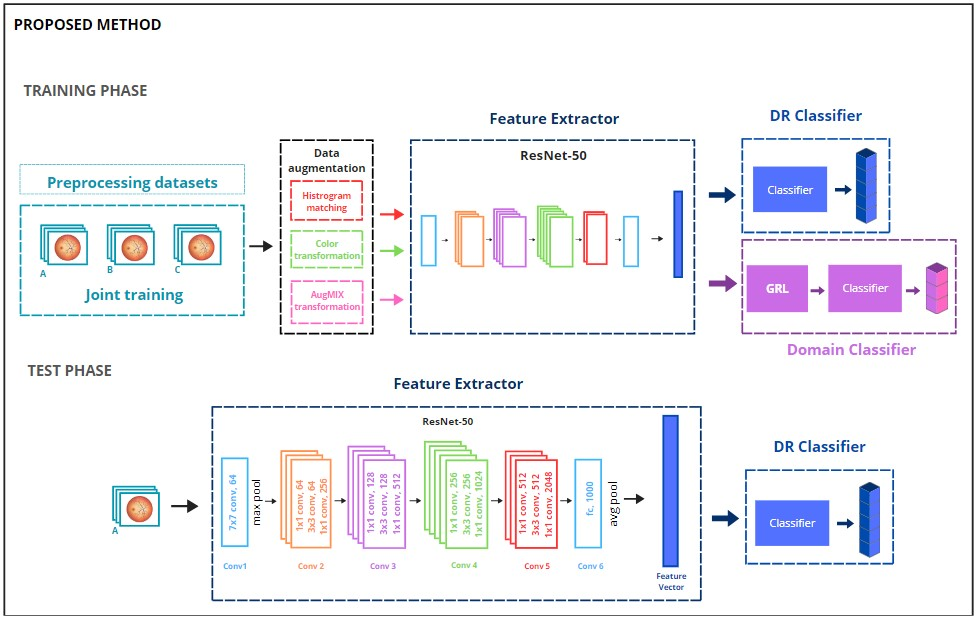

# Domain Generalization for Robust Diabetic Retinopathy Classification
Domain Generalization for Robust Diabetic Retinopathy Classification is a thesis project for M.Sc. Intelligent Adaptive Systems.

In this thesis, it has been suggested to apply domain adversarial training, an unsupervised, multi-source, multi-target domain generalization model that has been proven to perform robust diabetic retinopathy classification.

## Description
Three different models have been used for this thesis: baseline model, joint training model and domain adversarial training model. In addition, the influence of the data augmentations in achieving a robust model for domain generalization has been analyzed. An ablation study of the different techniques has been performed. A general overview of the proposed method can be seen in the following Figure. 

## Code description

- Dataset.py: this file allows to separate the images from EyePACS dataset by their corresponding camera labels.
- Functions.py: contains different functions that will make easier perform different actions of the project. 
- Preprocessing_dataset.ipynb: Write the folder that contains the images from which we want to remove the masks and resize to 512x512, and then write the folder that we want to move the images into.

## Installation
Within a particular ecosystem, there may be a common way of installing things, such as using Yarn, NuGet, or Homebrew. However, consider the possibility that whoever is reading your README is a novice and would like more guidance. Listing specific steps helps remove ambiguity and gets people to using your project as quickly as possible. If it only runs in a specific context like a particular programming language version or operating system or has dependencies that have to be installed manually, also add a Requirements subsection.

## Usage
Use examples liberally, and show the expected output if you can. It's helpful to have inline the smallest example of usage that you can demonstrate, while providing links to more sophisticated examples if they are too long to reasonably include in the README.

## Author
Sara Mínguez Monedero
